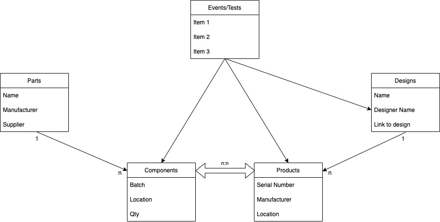
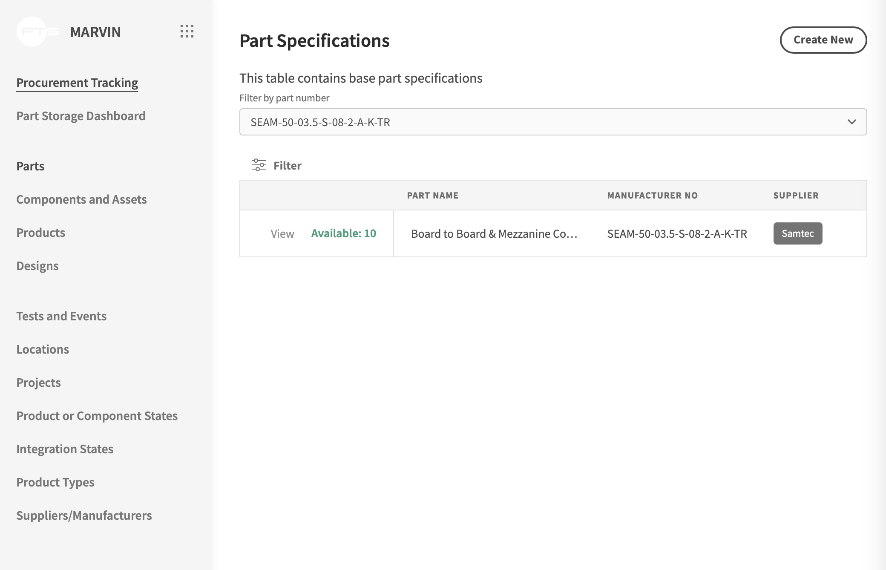
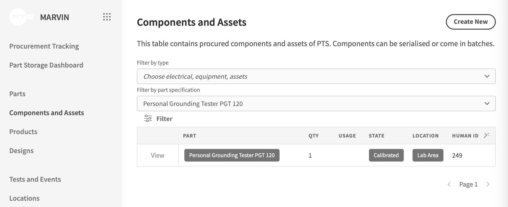
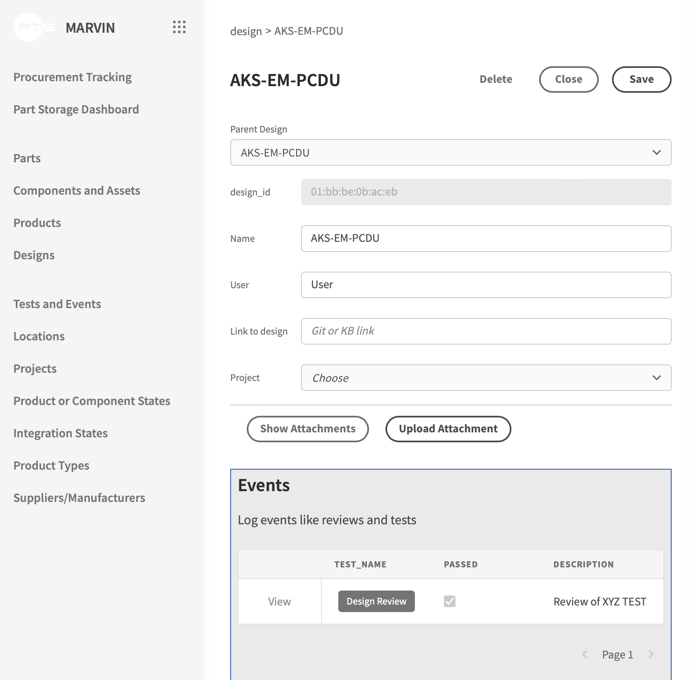
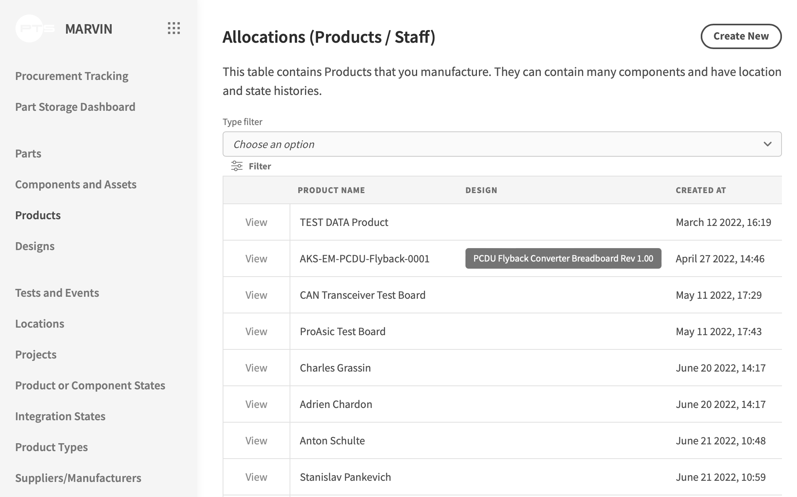
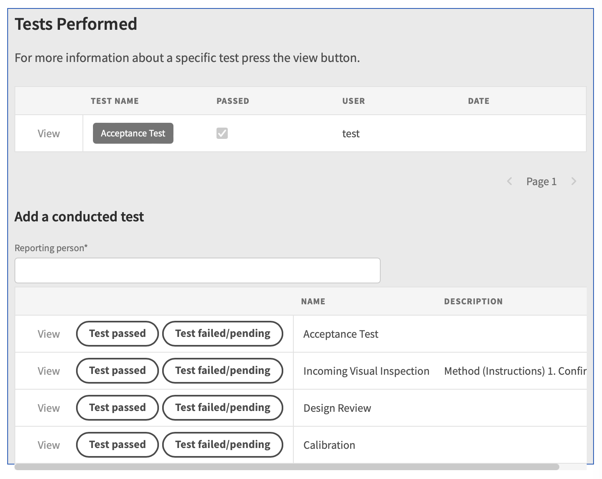
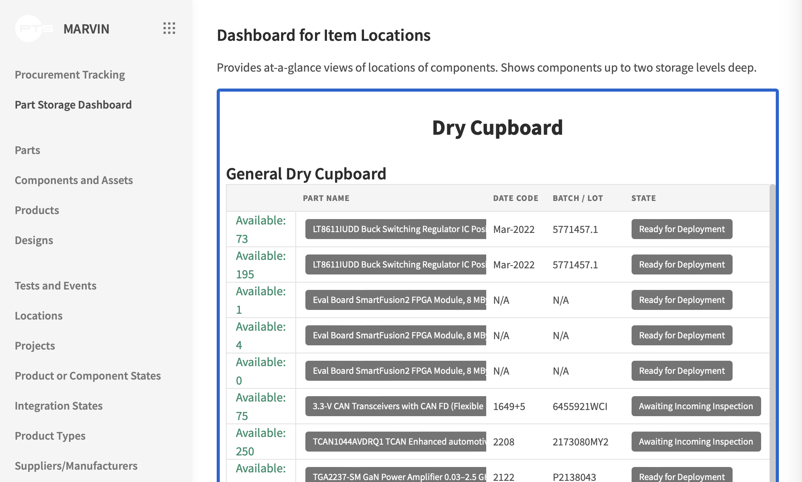

<h1 align="center">
  Marvin
</h1>


## About 
MARVIN is an Open Source Inventory, Supply Chain and Traceability System. It is designed to comply with EN 9100 and implemented at Planetary Transportation Systems GmbH.

## Contributors
MArvIN can only exist thanks to the support of PTS and the Budibase community.

## License
Copyright (c) 2022 [Planetary Transportation Systems GmbH](https://www.pts.space). All rights reserved. The software is distributed under GPL 3 License attached in this repository

## Features
MARVIN is a Planetary Transportation Systems GmbH internally developed, web-based tool to trace PCB Design, Production and Testing for space applications.

Key Features
* Traceability of Production Processes
* Component Batch identification and testing
* Assembly traceability

* Based on ECSS and EN 9001/9100 requirements
* Full forward and backward traceability
* Extended Customisability for flexible usage patterns

### User Friendly
Marvin delivers an integrated system for highly detailed Identification and Traceability reports with user friendly data entry for compliance with regulators. It provides Tracking of your raw materials through the production chain from suppliers, locations, transport, tests and product assembly. 

### Adaptable
Based on the low code platform Budibase and postgreSQL, MArvIN is both, easy to adapt and fast to integrate. 

## Setup and Installation
Marvin was tested and developed using Ubuntu 20.04. Other operating systems will most probably work.

### Minimum dependencies
* [postgreSQL](https://www.postgresql.org/download/linux/ubuntu/)
* [Docker](https://www.docker.com)
* [Budibase](https://docs.budibase.com/docs/budibase-cli-setup)

### Recommended
* [phpPgAdmin](https://github.com/phppgadmin/phppgadmin/releases)

### Setup


#### Database
Start posgreSQL
```
sudo systemctl start postgresql.service
```
[Import](https://www.postgresql.org/docs/8.1/backup.html#BACKUP-DUMP-RESTORE) Database structure 
```
psql marvin < marvin_db_(version).sql
```
#### Frontend
##### Initialize Budibase
Initialize and start budibase. If you cannot start using "budi", change directory to the chosen install path.
``` 
budi hosting --init

budi hosting --start
```

After some time Budibase will be available via HTTP at the configured port number. (default: http://127.0.0.1:10000)

##### Install Frontend 
Import the frontend file using the import tool.


## Understanding Marvin

The data in Marvin is stored within a PostgreSQL Database. The simplified data diagram below shows a course overview of its structure. The tables Parts and Designs contain "abstract" entities of which "real world" manifestations exist in "Components" & "Products. The items in "Components" & "Products" can be N:N related, meaning multiple components can be added to multiple products. Furthermore for many entities in the database tests & events can be saved which happened to a specific entity (e.g. batch testing, incoming inspections, etc).



### Part Specifications
In the "parts" section you can filter and scroll through all parts in the DB. To create a new part press "Create New". It is recommended to create a part before you create component iterations from it (eg. "part":Battery with part number 123, "component": manifest of battery 123 with serial number 987 and 200 load cycles"



### Components
In the "Components and Assets" window you can search and create manifestations of part specifications. All of them should be existing physical objects preferably with batch or serial numbers.



### Designs
Designs are abstract construction drawings, PCB designs or similar design specifications of a product you are building.



### Products
Products are physical or jet to be build manifestations of designs (eg. Computing Unit "XY" based on design "Xv1" containing components "Battery with serial number 987;....".



### Tests
Several items in the DB can have events/tests associated with them. They usually contain a date test type, result indication and user information.
This feature is especially useful for keeping track inspections, calibrations, reviews and more.



### Dashboards
Two dashboards are available at the moment. The storage dashboard shows where things are in a 2 level nested storage system.

